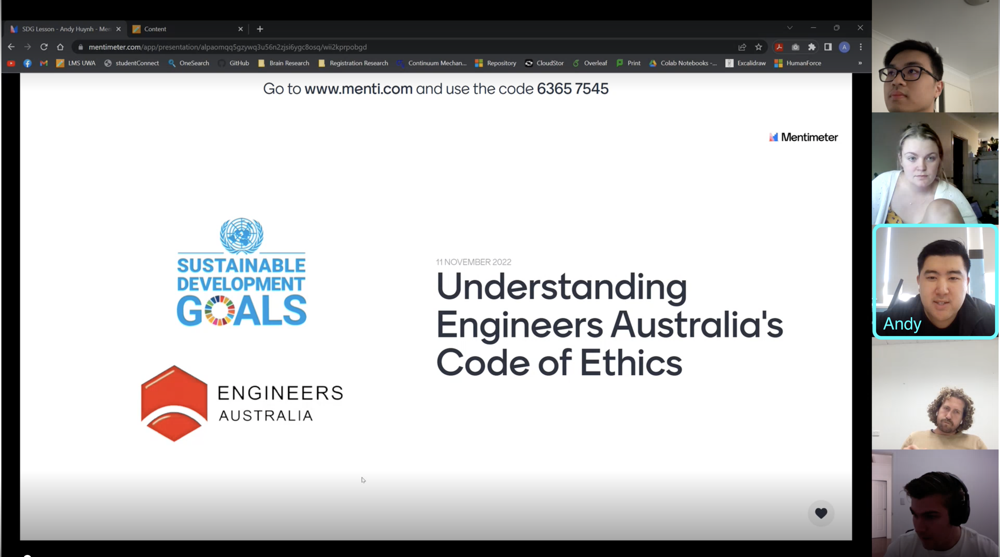

## SDG Lesson Slides

Understanding Engineers Australia's Code of Ethics  
https://www.mentimeter.com/app/presentation/alpaomqq5gzywq3u56n2zjsi6ygc8osq

## Lesson Plan

### 1. Lesson Starter/ Hook & Introduction
**Time:** 2.5 min  
**Activity:** For this part of the lesson, I will ask students to connect their devices (mobile/laptop) to Mentimeter which allows the lesson to be fully interactive with real-time feedback.  
**Purpose:** The purpose of this lesson is to recognise how engineer's promote sustainability through the Engineers Australia's Code of Ethics. In addition, to apply Code 4 of EA's Code of Ethics to existing or past projects and relate them to the Sustainability Development Goals.  
**Resources:** An example project will be used - 'The Ocean Cleanup' project. I will present a short 1-min video of one of the project's technology currently being deployed called the Interceptor. This video will act as a 'case study' for the following activies.

### 2. Active Learning Activity 
**Time:** 2.0 min  
**Activity:** There will be 2 short interactive activities for this part. The activities incorporates Mentimeters 'Interactive Live Polling' feature. First activity asks 'What SDG does 'The Ocean Cleanup' categories as?' and will allow students to vote from multiple choices. Second activity asks 'Which communities and stakeholders are most affected by this project?' and will allow students to rank different groups. For each activity, we will have a short discussion on our decisions.  
**Purpose:** The purpose of these activities is to engage the students and expose them to some critical thinking.  
**Resources:** Mentimeter's Tools/Functionality

### 3. Conclusion
**Time:** 0.5 min  
**Activity:** A poll will be used to allow students to rate the lesson based on two questions:  
(1) I have a better understanding of the values and principles that shape an Australian engineer.   
(2) I am able to link sustainble development goals to engineering projects.  
**Purpose:** This is used to give students time to reflect on the class as well as some feedback for future lessons.  
**Resources:** Mentimeter's Tools/Functionality

## Resources

Sustainable Development Goals  
https://sdgs.un.org/goals

Engineers Australia Code of Ethics   
https://www.engineersaustralia.org.au/sites/default/files/2022-08/code-ethics-guidelines-professional-conduct-2022.pdf

The Ocean Cleanup  
https://theoceancleanup.com/